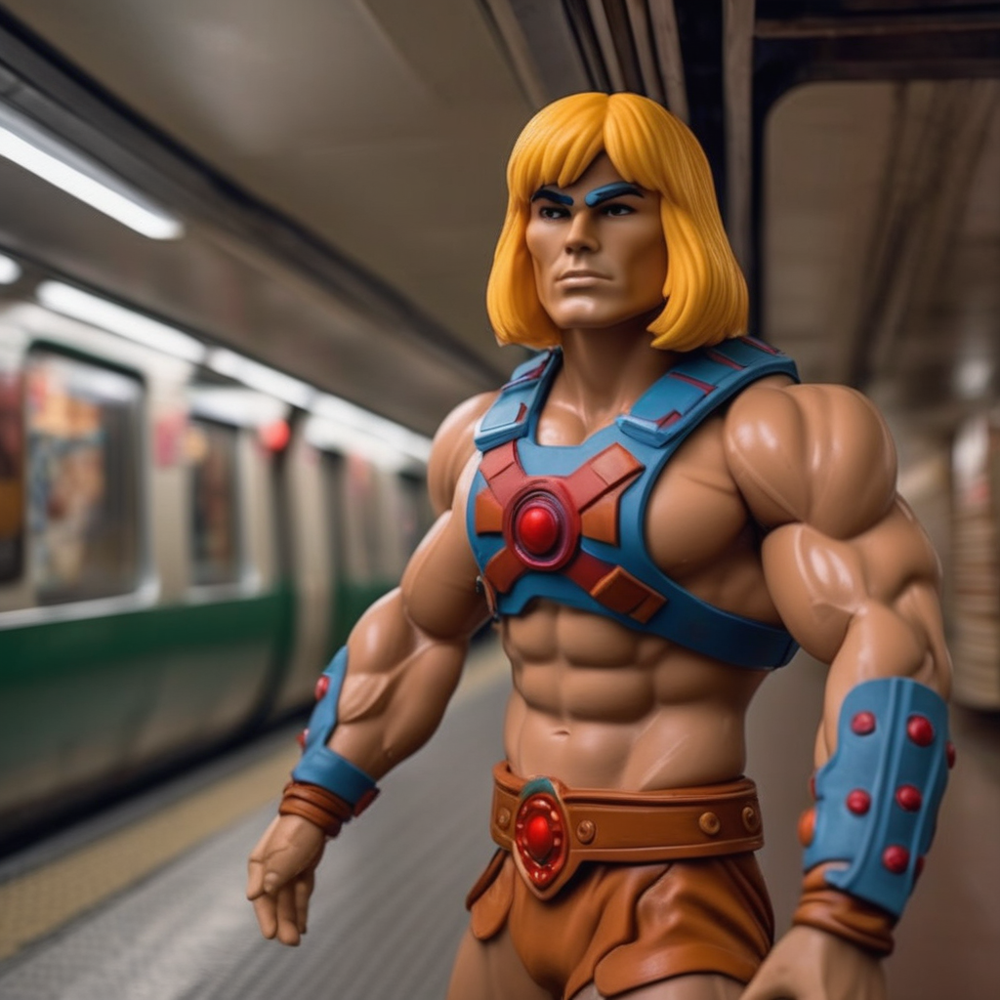
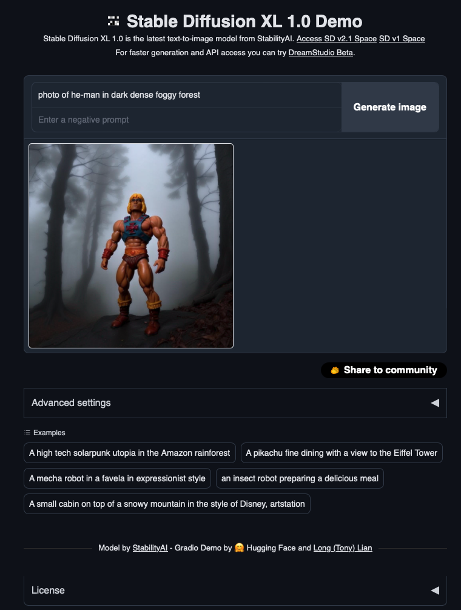

# Repositoriy zum iX Artikel über SDXL-Feintuning

## Inhalt
Dieses Repositoriy enthält die Google Colab Notebooks für folgende, drei Schritte:

1. [Notebook](https://github.com/rawar/ix-sdxl-dreambooth-lora/blob/main/create-dataset.ipynb) zur Erzeugen eines [eigenen Datasets](https://huggingface.co/datasets/Rawar/heman-toy) bestehend aus 9 Fotos einer He-Man Spielzeugfigur, welcher für das Feinetuning genutzt werden kann.
2. [Notebook](https://github.com/rawar/ix-sdxl-dreambooth-lora/blob/main/fine-tune-sdxl.ipynb) um aus dem [eigenen Dataset]((https://huggingface.co/datasets/Rawar/heman-toy)) mit Hilfe des [Diffuser-Frameworks](https://huggingface.co/docs/diffusers/index) von Hugging Face ein eigenes LoRA zu trainieren.
3. [Notebook](https://github.com/rawar/ix-sdxl-dreambooth-lora/blob/main/inference-lora-sdxl.ipynb) um das [eigene LoRA-Modell](https://huggingface.co/Rawar/heman-toy-lora-trained-sdxl) zu nutzen, um mit Stable Diffusion XL eigenen Bilder zu erzeugen.

## Bonus

Für das SDXL 1.0 [Web UI](https://github.com/TonyLianLong/stable-diffusion-xl-demo) von [Tony Lian](https://github.com/TonyLianLong/) habe ich einen Fork erstellt und das LoRA integriert um auch mit einer einfachen Oberfläche [He-Man](https://de.wikipedia.org/wiki/He-Man) Bilder generieren zu können. 

Das [Notebook](https://github.com/rawar/ix-sdxl-dreambooth-lora/blob/main/sdxl_webui.ipynb) kann auf einer GPU-Instanz von Google Colab ausgeführt werden. Die Gradio-App lässt sich dann über den Proxy-Link aufrufen.

 
 

